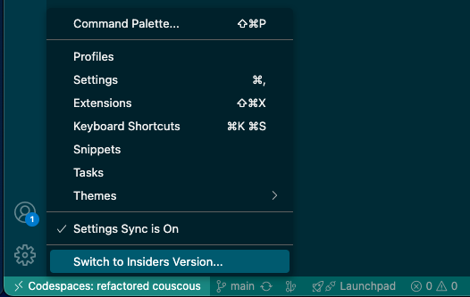

# OctoCAT Supply Chain Management - Demo Walkthroughs

Comprehensive demo environment showcasing GitHub's enterprise features using a modern TypeScript web application (React frontend + Express API) with an OctoCat Style!

## 🚀 Quick Setup

**Many demos can be shown without an IDE!** Most GitHub features (Issues, Projects, Actions, GHAS, Pull Requests) are web-based and don't require local development setup.

### For IDE-Based Demos

#### Option 1: Codespaces (Recommended)

- ✅ Zero setup - everything pre-configured
- ✅ Docker and dependencies included
- ✅ Automatic API endpoint detection for browser and local VS Code
- ❌ Some Copilot MCP demos (e.g., Playwright) won't work

#### Option 2: Local Checkout

- ✅ Full functionality including all MCP demos
- ✅ Better performance for intensive tasks
- ❌ Requires local setup (see [main README](../../README.md) for instructions)
- **Requirements**: Docker, GitHub PAT with repo permissions

### (optional) VSCode Insiders

You don't need VS Code Insiders unless demoing preview features. In Codespaces, switch via the gear icon (bottom-left) → `Switch to Insiders Version...`

## 📚 Available Walkthroughs

### 🤖 GitHub Copilot & AI Features

**File:** [copilot.md](./copilot.md)

Comprehensive demonstrations of GitHub Copilot's capabilities including:

- **Agent Mode & Vision**: Generate cart functionality using natural language and images
- **Unit Testing**: Automated test generation and coverage improvement
- **Custom Instructions**: Personalize Copilot for internal frameworks and standards
- **MCP Servers**: Playwright testing and GitHub API integration
- **Security Analysis**: Vulnerability detection and automated fixes
- **CI/CD Generation**: Automated workflow creation with Actions and Infrastructure as Code
- **Copilot Coding Agent**: Async task handoff and parallel experimentation

### 🛠️ Agent Skills

**File:** [agent-skills.md](./skills.md)

Demonstrate how Agent Skills encode specific knowledge/patterns/instructions for consistent code generation:

- **Skills Overview**: What Agent Skills are and how they work - as well as when to use Skills vs Custom Instructions
- **API Endpoint Generation**: Use the `api-endpoint` skill to add a new entity (DeliveryVehicle)
- **Pattern Adherence**: Show how generated code follows the encapsulated skill definition

### ⚙️ GitHub Actions & CI/CD

**File:** [actions.md](./actions.md)

Workflow and automation demonstrations:

- **Required Workflows**: Organization-level workflow enforcement
- **Dependency Review**: Automated security checks for dependencies
- **Ruleset Integration**: How workflows integrate with repository governance

### 🏛️ Governance & Compliance

**File:** [governance.md](./governance.md)

Enterprise governance features:

- **Repository Rulesets**: Dynamic rule enforcement based on metadata
- **Custom Properties**: Repository classification and automated policy application
- **Branch Protection**: Pull request requirements and security scanning
- **Compliance Workflows**: Required security and quality checks

### 📊 Issues & Project Management

**File:** [issues-and-projects.md](./issues-and-projects.md)

Project planning and tracking demonstrations:

- **Issue Management**: Types, dependencies, and sub-issues
- **Project Boards**: Agile workflow visualization with custom fields
- **Sprint Planning**: Iteration management and capacity planning
- **Team Collaboration**: Multi-squad coordination and assignment
- **Analytics & Insights**: Project health and progress tracking

## 💡 Tips for Success

- **Non-deterministic AI**: Copilot responses vary - be prepared to adapt
- **Practice**: Rehearse all scenarios before live demonstrations
- **Mix & Match**: Combine different walkthroughs based on audience needs

---

**Need help?** Each walkthrough file contains detailed step-by-step instructions and troubleshooting guidance for successful demonstrations.
